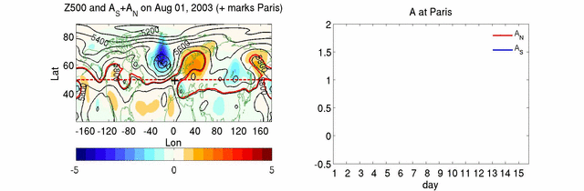

Codes for computing local wave activity (LWA) described in [Chen et al. 2015](../../../publication/2015-12-1-Chen2015). See an example of the output from jupyter notebook [here](./test_tracer_eq_local.html)

- Matlab code
    * [tracer_eq_1var_2d_local3.m](./tracer_eq_1var_2d_local3.m): subroutine to compute local wave activity
    * [test_tracer_eq_local.m](./test_tracer_eq_local.m): sample script to run the local wave activity code with idealized wave perturbations

- Python code
    * [tracer_eq_1var_2d_local4.py](./tracer_eq_1var_2d_local4.py): subroutine to compute local wave activity
    * [test_tracer_eq_local.ipynb](./test_tracer_eq_local.ipynb): sample jupyter notebook script to run the local wave activity code with idealized wave perturbations

- Fortran 90
    * Example to ccompute zonal mean wave activity: [compute_wave_activity-1.f90](./compute_wave_activity-1.f90) and [compute_sort.f90](./compute_sort.f90)

Example of LWA for European summer heat waves in 2003:
