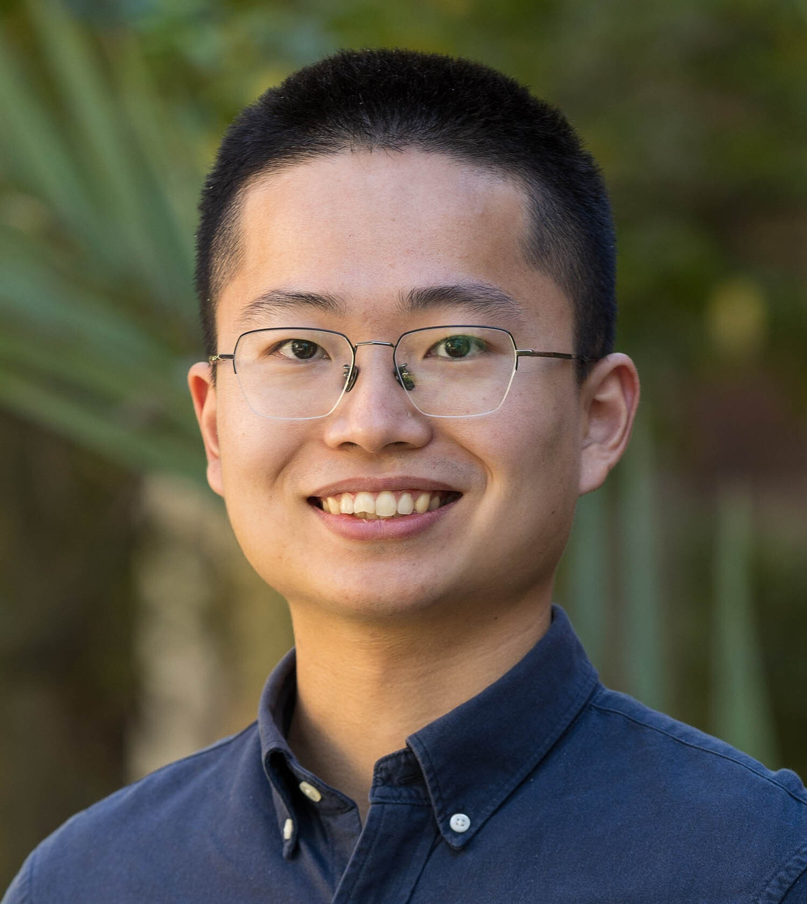

::: {.page-with-sidebar}

::: {.sidebar-col}

:::

::: {.content-col}

## Current Group Members

<strong>Gang Chen</strong>
 Professor
 Math Sciences Building 7149
 gchenpu at atmos dot ucla dot edu
 (310) 206-9956

<strong>Xiuyuan Ding</strong>
 Postdoc

<strong>Kezhou Lu (Melody)</strong>
 Postdoc

<strong>Anna Coomans</strong>
 Master Student

<strong>Jason Ge, Siofra Linden, Tyler Do</strong>
 Undergraduate Students

---

## Former Group Members

### Postdocs

- Pengfei Zhang (Assistant Research Professor, Penn State Univ)
- Marianna Linz (Assistant Professor, Harvard)
- Jesse Norris (Project Scientist, UCLA)
- Chengji Liu (Software engineer, Google)
- Patrick Martineau (Researcher, JAMSTEC: Japan Agency for Marine-Earth Science and Technology)
- Daniela Domeisen (Associate Professor at University of Lausanne, Switzerland)
- Lantao Sun (Research Scientist, Colorado State Univ)

### PhD Students

- Bowen Ge (CMA)
- Xiuyuan Ding (Postdoc, UCLA)
- Weiming Ma (Postdoc, PNNL)
- D. Alex Burrows (RedLine, working with NOAA/NCEP)
- Huang Yang (Data Scientist, TikTok)

### Master Students

- Shujun Zhou (co-advising with Yu Gu) (PhD student at U Maryland)
- Zhan Shi (PhD student at UC Davis)

### Selected Visiting Scholars or Students

- Jezabel Curbelo (Now at Universitat Politècnica de Catalunya, Departament de Matemàtiques)
- Yuexiang Sun (Graduate Student from Peking Univ)

### Selected Undergraduate Advisees

- Emilio Yanez (Graduate Student, UCSD)
- Noah Alviz ([National Weather Service Meteorologist](https://www.linkedin.com/in/noahalviz/))
- Jiyang (Iris) Du (Graduate Student, U of Cambridge)
- Jing Wang (Graduate Student, Princeton)
- Boer Zhang (Graduate Student, Harvard)
- Ziwei Wang (Graduate Student, U Chicago)
- Zeyuan Hu (Graduate Student, Harvard)
- Elisa Raffa ([TV Meteorologist](https://www.facebook.com/MeteorologistElisaRaffa/))
- Zack Labe (Graduate Student, UC Irvine)
- Gaige Kerr (Graduate Student, Johns Hopkins Univ.)
- Aaron Match (Graduate Student, Princeton)
- Noah Singer (Graduate Student, USC)

:::

:::
