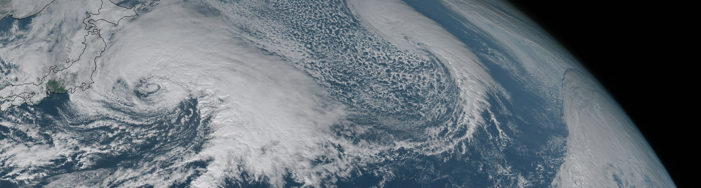

{.hero-banner}

::: {.page-with-sidebar}

::: {.sidebar-col}

:::

::: {.content-col}

My research focuses on atmospheric dynamics and climate, with an emphasis on the fundamental processes in large-scale atmospheric circulation and transport that shape weather and climate extremes. Through a combination of theory and numerical modeling, my group develops process-based insights into global atmospheric circulation in a changing climate. By bridging climate theory, numerical modeling, and observations, we improve confidence in both historical simulations and future projections of global and regional circulation patterns and associated extreme events.

The first major thrust of my research is to advance understanding of fluid dynamics and transport in the extratropical circulation. Of particular interest are the westerlies, which extend from the surface to the stratosphere and play a key role in the dynamics, predictability, and chemistry of these regions. To understand what dynamical mechanisms drive the latitudinal shifts of jet streams, we have examined the sensitivities of midlatitude westerlies to climate forcing and the processes driving their latitudinal variations ([Chen and Held 2007](publication/2007-11-1-Chen2007b.qmd); [Sun et al. 2013](publication/2013-8-1-Sun2013.qmd); [Chen et al. 2020](publication/2020-2-1-Chen2020.qmd)).  We have also investigated how changes in jet streams affect midlatitude circulation waviness and associated weather extremes under climate change ([Chen et al. 2015](publication/2015-12-1-Chen2015.qmd); [Chen et al. 2022](publication/2022-3-1-Chen2021.qmd); [Nie et al. 2023](publication/2023-3-1-Nie2023.qmd)). More fundamentally, my work explores how atmospheric dynamics and transport can be understood in the framework of eddy diffusivity theory, thereby integrating the two perspectives from Rossby wave dynamics and eddy diffusivity theory ([Chen and Plumb 2014](publication/2014-9-1-Chen2014.qmd); [Yang et al. 2016](publication/2016-4-1-Yang2015.qmd)).

The second, more recent theme examines how large-scale atmospheric circulation shapes weather extremes, such as cold snaps, heat waves, atmospheric rivers, and heavy precipitation events that exert disproportionate socioeconomic impacts. For example, we have investigated mechanisms that link to extreme stratospheric events to extreme cold events over North America, such as the February 2021 cold wave that disrupted the Texas energy infrastructure ([Ding et al. 2022](publication/2022-3-1-Ding2022.qmd); [Ding et al. 2023](publication/2023-5-1-Ding2023.qmd)). We have also studied the mechanisms of moisture intrusions into polar regions in a warming climate ([Ma et al. 2020](publication/2020-11-1-Ma2020a.qmd); [Zhang et al. 2023](publication/2023-2-1-Zhang2023.qmd)) and developed a conditional mean framework linking precipitation statistics to the moisture budget ([Chen et al. 2018](publication/2018-12-1-Chen2018a.qmd); [Norris et al. 2018](publication/2018-12-1-Norris2018.qmd)).

## Recent Publications

```{python}
#| echo: false
#| output: asis
import os, re, yaml
from html import unescape

pub_dir = "./publication"

def parse_pub(fname):
    with open(os.path.join(pub_dir, fname)) as f:
        content = f.read()
    if not content.startswith('---\n'):
        return None
    parts = content.split('\n---\n', 1)
    if len(parts) != 2:
        return None
    try:
        fm = yaml.safe_load(parts[0][4:])
    except yaml.YAMLError:
        return None

    # Preferred key avoids conflict with Quarto reserved metadata name.
    if fm.get('recommended_citation') and not fm.get('citation'):
        fm['citation'] = fm['recommended_citation']

    # Fallback for older pages that may not store citation in YAML.
    if not fm.get('citation'):
        m = re.search(r'\*\*Recommended citation:\*\*\s*(.+)', parts[1])
        if m:
            fm['citation'] = m.group(1).strip()
    return fm

pubs = []
for fname in os.listdir(pub_dir):
    if fname.endswith('.qmd'):
        p = parse_pub(fname)
        if p:
            parts = fname.split('-')
            try:
                p['_month'] = int(parts[1])
                p['_day'] = int(parts[2])
            except (IndexError, ValueError):
                p['_month'] = 0
                p['_day'] = 0
            p['_fname'] = fname
            pubs.append(p)

pubs.sort(key=lambda x: (int(x.get('year', 0)), x.get('_month', 0), x.get('_day', 0)), reverse=True)
# skip thesis entries for recent list
recent = [p for p in pubs if not re.search(r'thesis', p.get('venue', ''), re.IGNORECASE)][:5]

print('<ul style="list-style:none;padding-left:0;">')
for pub in recent:
    cit = unescape(pub.get('citation', pub.get('title', '')))
    title = unescape(pub.get('title', ''))
    slug = pub.get('_fname', '').replace('.qmd', '')
    url = f'publication/{slug}.html' if slug else ''
    if url and title:
        linked_cit = cit.replace(title, f'<a href="{url}" target="_blank" rel="noopener">{title}</a>', 1)
    else:
        linked_cit = cit
    print(f'<li style="padding:0.6rem 0;border-bottom:1px solid #eee;">')
    print(f'<div style="font-size:0.92rem">{linked_cit}</div>')
    print('</li>')
print('</ul>')
```

:::

:::
